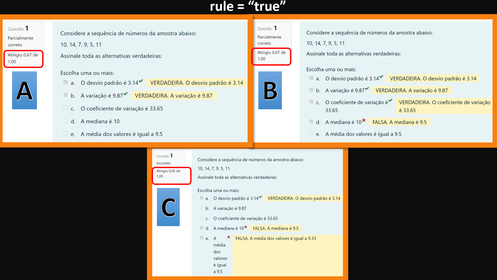

```{r klippy, echo=FALSE, include=TRUE}
#install.packages("remotes")
#remotes::install_github("rlesur/klippy", force = TRUE)
library(klippy)
klippy::klippy(
  lang = c("r", "markdown"),
  all_precode = FALSE,
  position = c("top", "right"),
  color = "auto",
  tooltip_message = "Copy code",
  tooltip_success = "Copied!"
)
```

# Introdução

R/Exams é um pacote da linguagem R que permite a criação de exercícios dinamicamente que podem ser exportados para o ambiente Moodle, especialmente útil para conteúdo de matemática, estatística ou física. A maior vantagem da utilização deste sistema é a possibilidade de gerar diferentes versões do mesmo exercício com diferenças aleatórias nas variáveis do exercício. Possibilita ainda fornecer feedbacks com resoluções detalhadas de fórmulas e gráficos específicos para cada versão do exercício, melhorando assim o processo de avaliação no ensino a distância. 
Utilizando a interface de desenvolvimento RStudio, e o pacote RMarkdown <https://rmarkdown.rstudio.com/>, que possibilita criar os exercícios dinâmicos que podem ser exportados para o ambiente Moodle.

## O software R e a interface gráfica RStudio
O R é uma linguagem de programação open source para análise de dados que fornece uma grande variedade de ferramentas estatísticas e gráficas [Curso-R](https://livro.curso-r.com/index.html).  
RStudio é um ambiente de desenvolvimento integrado (IDE) para R. Inclui um console, editor de realce de sintaxe que oferece suporte à execução direta de código, bem como ferramentas para plotagem, histórico, depuração e gerenciamento de espaço de trabalho [[RStudio]](https://www.rstudio.com/products/rstudio/download/)
  
- *Instalação do R e RStudio*  
  
Acesse o [CRAN](https://www.r-project.org/)  
No menu à esquerda, encontre a opção Download e clique em CRAN.  
Escolha a opção de servidor (mirror) mais próxima de você.  
Clique na opção base.  
Na nova página, clique em **Download R x.x.x for Windows**, onde x.x.x o número da versão que será baixada.  
Feito o download, abra o arquivo baixado e siga as instruções para instalação.  

[RStudio](https://www.rstudio.com/products/rstudio/download/)
{width=200px}  
RStudio é um ambiente de desenvolvimento integrado (IDE) para R. Inclui um console, editor de realce de sintaxe que oferece suporte à execução direta de código, bem como ferramentas para plotagem, histórico, depuração e gerenciamento de espaço de trabalho [[RStudio]](https://www.rstudio.com/products/rstudio/download/).

### Pacote TIDYVERSE
{width=150px}


O `Tidyverse` traz consigo o manifesto tidy. Trata-se de um documento que formaliza uma série de princípios que norteiam o desenvolvimento do tidyverse. Como os pacotes do `tidyverse` compartilham os mesmos princípios, podem ser utilizados naturalmente em conjunto.  
Pode-se dizer que existe uma linguagem R antes e outra depois do `tidyverse`. A linguagem mudou muito, a comunidade abraçou uso desses princípios e criou centenas de novos pacotes que conversam uns com os outros dessa forma.   
O `tidyverse` é um pacote guarda-chuva que agrega diversos outros pacotes que proporcionam um ferramental incrível análise de dados.  
Fazem parte do {tidyverse} pacotes  para importação de dados (`readr`), organização de dados (`dplyr`, `tidyr`, `tibble`), manipulação de textos (`stringr`), datas (`lubridate`), visualização de dados (`ggplot2`) e diversos outros.  
{width=350px}
  
Veremos as características principais desses pacotes a seguir.  
Os princípios fundamentais do tidyverse são:  
* Reutilizar estruturas de dados existentes.  
* Organizar funções simples usando o pipe `|>`.  
* Aderir à programação funcional `purrr`.  
* Projetado para ser usado por seres humanos.  

*Resumo das funcionalidades para manipulação*:  
* arrange(): ordena os registros pelas variáveis.  
* select(): seleciona variáveis (subconjunto de colunas).  
* filter(): filtra registros (subconjunto de linhas).  
* mutate(): modifica/cria variáveis.  
* group_by(): realiza agrupamento para realização de agregações.  
* summarize(): aplica agregrações (e.g. médias por grupo).  
* pivot_wider(): passa de formato longo para amplo (long -> wide).  
* pivot_longer(): passa de formato amplo para longo (wide -> long).   
* inner_join(): faz a fusão de duas tabelas conforme chaves.  


> Saiba mais sobre o R e RStudio em:

>> [Playlist Introdução ao Software R](https://youtu.be/vyMRwG3dA48) {width=50%}

>> [Curso-R](https://livro.curso-r.com/index.html)
{width=30%}

>> [R for Data Science](https://r4ds.had.co.nz/). 
{width=10%}  


## R Markdown
### O que é R Markdown?
O Markdown é uma linguagem de marcação muito simples, desenvolvida por John Gruber {width=15%}.

O pacote `rmarkdown` ajuda a criar documentos de análise dinâmica que combinam código, saída renderizada (como figuras) e texto em Markdown. O usuário insere seus dados, código e narrativas, e o pacote inclui os mecanismos necessários para renderizar o conteúdo em um documento final bem acabado.

## Vantagens do uso de R Markdown
A ideia básica por trás da linguagem é fazer com que o escritor se preocupe mais com o **conteúdo** do texto do que com a *formatação*.

Markdown é uma sintaxe de formatação simples para criação de documentos HTML, PDF e MS Word. Para obter mais detalhes sobre o uso do R Markdown, consulte <http://rmarkdown.rstudio.com>.  

## Instalação do pacote rmarkdown
No RStudio, esse pacote já vem instalado. Basta criar o documento: conforme sequência abaixo:  
File > New File > RMarkdown.  

## Criando um Rmarkdown  

Para criar um documento R Markdown, clicamos no botão:  
File > New File > RMarkdown.
  
Na sequência selecionamos a opção “Document” na janela que aparecera, digitar o título do documento e, opcionalmente, o nome do autor nos campos à direita e em *Default Option Format*, escolhemos qual o formato do documento de saída, para o qual será convertido: HTML, PDF ou Word, por padrão está marcado HTML, podendo ser alterado depois no cabeçalho YAML do próprio arquivo R Markdown, por fim, clicar em “OK”.  
  
Será então criado um novo bloco, este bloco é um editor de código que contém nosso arquivo R Markdown, onde podemos escrever texto com sintaxe Markdown misturado com código R ou de outras linguagens de programação.
  
Na primeira vez, após a instalação do RStudio, que for criado um arquivo R Markdown o próprio RStudio irá oferecer a instalação de alguns pacotes adicionais necessários, basta aceitar e aguardar a instalação automática.
  
O documento recém criado vem “preenchido” com o cabeçalho YAML que contém os dois parâmetros de metadados que definimos no momento de criação do documento: o título e o formato do documento de saída. Podemos modificar estes parâmetros neste cabeçalho.

Após o cabeçalho YAML, o documento possui uma espécie de “template” exemplificativo, contendo alguns trechos de texto em Markdown e código R. Podemos alterar ou apagar isso livremente.
  
Ainda é necessário salvar o arquivo R Markdown e dar um nome a ele. O nome que foi dado no momento de criação do arquivo corresponde ao título do Documento ou Relatório que será criado, mas não ao nome do arquivo.
  
Para salvar o arquivo basta clicar no ícone em forma de disquete que fica na barra de ferramentas do próprio bloco do editor R Markdown (não confundir com a barra de ferramentas do RStudio em si, que fica logo acima e também tem um outro botão de salvar idêntico).  
  
> Saiba mais sobre R Markdown em:

>> [GROLEMUND, Garrett. *Introduction to R Markdown*. 2014](https://rmarkdown.rstudio.com/articles_intro.html)

>> [XIE, Yihui; DERVIEUX, Christophe; RIEDERER, Emily. *R Markdown Cookbook*. Boca Raton: CRC Press, 2020.](https://www.amazon.com.br/R-Markdown-Cookbook-Yihui-Xie/dp/0367563835?__mk_pt_BR=%C3%85M%C3%85%C5%BD%C3%95%C3%91&dchild=1&keywords=rmarkdown&qid=1631373223&sr=8-1&ufe=app_do%3Aamzn1.fos.e05b01e0-91a7-477e-a514-15a32325a6d6&linkCode=ll1&tag=inturb-20&linkId=76ce1afff72e4bfaf9ee7cd98d3d22b9&language=pt_BR&ref_=as_li_ss_tl)

>> [XIE, Yihui; ALLAIRE, J. J.; GROLEMUND, Garrett. *R Markdown*: The Definitive Guide. 2023](https://bookdown.org/yihui/rmarkdown/)


# R/Exams

No console do R, instale o pacote `R/exams` executando o código:
`install.packages(“exams”)` e em seguida carregue o pacote com o comando
`library(exams)`.

````{verbatim class.source='klippy'}
```{r, warning=FALSE, message=FALSE}
install.packages("exams")
library(exams)
``` 
````

## Fluxo para criação de questões em R/exames

O ponto de partida é escrever a questão (potencialmente) dinâmica em Rmarkdown. A partir dessa questão, no formato R/Markdown, uma série de replicações aleatórias podem ser extraídas utilizando a função `exams2moodle()` para exportar para o formato XML.  
Eformato XML é o formato de arquivo padrão para importação de questões no Moodle, assim, o arquivo XML gerado pode ser importado diretamente para o Moodle.  
  
{width=60%}
  
  
O R/Exams suporta os tipos de exercícios : escolha única (`schoice`),
escolha múltipla (`mchoice`), numérico (`num`), string (`string`) ou
combinações destes (`cloze`).

## Tipos básicos de questões

São quatro os tipos básicos de questões:  

-   Numérica  
-   Texto curto  
-   Única escolha  
-   Múltipla escolha  

## Criando uma questão com Rmarkdown

Para criar uma questão com R Markdown, clicamos no botão:  
File \> New File \> RMarkdown como vimos na aula passada.  

## Numérica (num)
A resposta da questão é um número, podendo ser inteiro ou decimal. Uma margem de erro (tolerância) pode ser definida para compor um intervalo de respostas aceitas como corretas.  
  
### Cálculo da Média simples
Vejamos o exemplo simples abaixo, que servirá para entendermos a estrutura de criação de uma questão do tipo numérica:  
  

  
  
Observe que a questão já foi respondida e o feedback com a resolução detalhada é apresentada.  
 
Vejamos o código desta questão:  

````{verbatim class.source='klippy'}
Question
==========

Qual a média entre $5.2$, $6.5$, $7.7$? 
  
> Obs. Arredonde o resultado para duas casa decimais.

Solution
==========

Cálculo da média amostral:

$$
\bar{X} = \frac{\sum_{i=1}^{n} x_i}{n}  \\
\bar{X} = \frac{(5.2 + 6.5 + 7.7)}{3}  \\
\bar{X} = \frac{19.4}{3}  \\
\bar{X} = 6.466667 \\
\bar{X} \approx 6.47 \\
$$

Meta-information
==========

exname: título da questão  
extype: num  
exsolution: 6.47  
extol: 0.01
````

> Faça o download da questão em formato RMD no link abaixo:   
> [1. num_media_1.Rmd](https://ava.uft.edu.br/edsuft/pluginfile.php/20652/mod_folder/content/0/1.%20num_media_1.Rmd?forcedownload=1)   


Vamos analisar com muita atenção as marcações.  
Observe que são três os campos fundamentais para criar uma questão:

* Question  
* Solution  
* Meta-information  
  
A marcação do texto inicia com a palavra-chave `Question` sublinhada com uma sequência de sinais `=` (igual). Abaixo colocamos o texto do cabeçalho da questão.  
  
Depois temos a palavras-chave `Solution` com a resolução detalhada elaborada em LATEX.  

Na parte final, `Meta-information`, preenchemos algumas informações sobre a questão:

`exname`: Nome (apelido) para a questão.  
`extype`: Tipo básico da questão, neste exemplo, `num`.  
`exsolution`: Resposta correta.  
`extol`: a tolerância da resposta numérica. Neste caso, a resposta correta é 6,47 mas as respostas aceitas como corretas ficam dentro do intervalo 6.47 ± 0.01 [6.46 a 6.48].  

> Mais sobre meta-informações em R/exames
>> [Clique aqui](https://stackoverflow.com/questions/73713203/possible-meta-informations-in-r-exams)  

Observe também que o “.” (ponto) é o separados de decimal, tanto em exsolution quanto em extol. No moodle, quando o respondente for responder, são aceitos tanto “,” (vírgula) como “.” (ponto) para decimal.

Esse exemplo é simplório, os valores são fixos e a resposta também, porém podemos utilizar as ferramentas de aleatorização de dados do r para melhorar a questão.` 

### Numérica com dados gerados - Média
Geramos de dados e elaboramos uma questão com uma resposta do tipo numérica. Na figura abaixo, temos uma versão da questão gerada a partir da escolha aleatória dos valores:  


Observe que a questão já foi respondida, porém a resposta está errada, mesmo sendo um valor próximo ao valor correto, não atendeu a margem de tolerância (extol) e o feedback com a resolução detalhada é apresentada.  
 
Vejamos o código desta questão:  

````{verbatim class.source='klippy'}
```{r echo=FALSE, results="hide", warning=FALSE, message=FALSE}
library(exams)
n <- 5 # Número de dados (tamanho da amostra)
dados <- round(runif(n = n, 
                     min = 10, 
                     max = 50), 1) # Gerando os dados com distribuição Uniforme entre 10 e 50.
ss <- sum(dados) # Soma dos dados
med <- ss/n # Média amostral
resp <- fmt(med, 2) # Resposta
```

Question
==========

Qual a média entre `r dados`? 

OBS. Arredonde o resultado para duas casa decimais.

Solution
==========


O cálculo da média amostral:  

$$
\begin{align*}
\bar{x} &= \frac{1}{n} \sum_{i=1}^{n} x_i \\
        &= \frac{1}{`r n`} \, (`r paste(dados, collapse = "+")`) \\
        &= \frac{1}{`r n`} \, `r ss` \\
        &= `r med` \\
        &\approx `r resp` \\
\end{align*}
$$

Meta-information
==========

exname: media
extype: num
exsolution: `r resp`
extol: 0.01
````

> Faça o download da questão em formato RMD no link abaixo:   
> [2. num_media_2.Rmd](https://ava.uft.edu.br/edsuft/pluginfile.php/20652/mod_folder/content/0/2.%20num_media_2.Rmd?forcedownload=1)   


O arquivo inicia com um trecho de código em R:  
`{r echo=FALSE, results="hide", warning=FALSE, message=FALSE}`  

A opção `echo=FALSE` indica que o código em si não será incluído no texto final da questão, mas os objetos gerados podem ser utilizados a seguir.  

As opções `results="hide"`, `warning=FALSE` e `message=FALSE` são para ocultar a saída do código.  

> Outra opção é utilizar o `include=FALSE` no lugar o do `echo=FALSE`,
> essa opção `include` esconde tanto o código quanto a saída do código
> no texto final da questão, mas os objetos gerados podem ser utilizados
> a seguir, ou seja, o `include=FALSE` faz o mesmo que utilizar
> `echo=FALSE` e `eval=FALSE` simultameamente.

Em `library(exams)` carrega o pacote `exams` que contem as funções úteis.  
  
O tamanho da amostra, ou número de valores que serão gerados, é definido na variável `n`: `n <- 5 # Número de dados (tamanho da amostra)`.  
  
Em `dados <- round(runif(n = n, min = 10, max = 50), 1)`, é criado um objeto que contém n números aleatoriamente escolhido entre 10 e 50.  
  
Em `ss <- sum(dados) # Soma dos dados` é calculada a soma dos valores gerados.  
  
Em `med <- ss/n # Média amostral` é calculada a média amostral.  
  
Em `resp <- fmt(med, 2) # Resposta` é formatada a resposta para duas casas decimais.
  
Na marcação Question, após o cabeçalho da questão, temos o texto e um trecho de código in line `` `r knitr::inline_expr("dados")` ``  para escrever os dados da questão.  

Em `Solution`, é definido o feedback que será apresentado após a resposta da questão. Em linguagem `LATEX` o cálculo da média amostral, que é a soma dos valores dividido pelo número de valores é detalhado com os valores de cada uma das versões da questão.

O uso código Latex para escrever fórmulas matemáticas é muito versátil. O código em Latex deve ser colocado entre símbolos \$ (cifrão) para aparcever na linha ou sifrão duplo \$\$ para em bloco.  

````{verbatim class.source='klippy'}
$$
\begin{align*}
\bar{x} &= \frac{1}{n} \sum_{i=1}^{n} x_i \\
        &= \frac{1}{`r n`} \, (`r paste(dados, collapse = "+")`) \\
        &= \frac{1}{`r n`} \, `r ss` \\
        &= `r med` \\
        &\approx `r resp` \\
\end{align*}
$$
````


No topico `Meta-information`, tem-se `exsolution` que usou-se o código `` `r knitr::inline_expr("resp")` `` para escrever a solução, e em `extol` definimos uma tolerância de `0.01` para o intervalo de respostas aceitas como corretas.  


### Importação e exportação de questões
Acesso seu ambiente Moodle de sua disciplina em que você seja o professor, caso não tenha, você pode usar o `Moodle 4.3 sandbox demo`.

> DICA:  
>> [Moodle 4.3 sandbox demo](https://sandbox.moodledemo.net/)   
>> [Accessing the moodle demo sandbox]( https://youtu.be/_vedXz8HdLA)  


As etapas da construção do questionário no Moodle com as questões elaboradas no R são as seguintes:

1. Elaboração das questões em rmarkdown.  
2. Exportação para um arquivo XML.  
3. Importação para o banco de questões do Moodle.  
4. Construção do questionário de avaliação no Moodle.  

Essa primeira etapa de elaboração de questões já exploramos anteriormente. Vamos agora a Exportação das questões para o formato XML.  

### Exportação para um arquivo XML.  

Utiliza-se da função `exams2moodle()` do pacote `exams{}` para converter a questão elaborada em RMD para um arquivo XML. Neste arquivo XML terá todas as n versões aleatórias.  
  
Setando o diretório de trabalho (local do arquivo a ser exportado)  
````{verbatim}      
```
setwd("~/Curso - R-Exams IME USP/questoes/avançadas")
```
````


Instalar e carregando o pacote `exams`
````{verbatim class.source='klippy'}      
# Instar o pacote "exams"
install.packages("exams")

# Carregar o pacote "exams"
library("exams")
```` 


Exportar uma questão para XML utilizando a função `exams2mooodle`
````{verbatim class.source='klippy'}
# Exportar uma questão para XML utilizando a função "exams2mooodle"
exams::exams2moodle(file = "2. num_media_2.Rmd", 
                    n = 5, 
                    verbose = TRUE,
                    name = "2. num_media_2")
````


### Questão de numérica - Derivada
Observe duas realizações de uma questão do tipo numérica, sobre o claculo da derivada de uma função, mais especificamente sobre a regra da cadeia.  
No feedback da questão foi adicionado um link para um vídeo explicativo sobre a regra da cadeia. Além do cálculo detalhado da derivada e a questão pede para avaliar a derivada em um ponto específico.


````{verbatim class.source='klippy'}
```{r data generation, echo = FALSE, results = "hide", message = FALSE, warning = FALSE}
library(exams)
library(knitr)
options(scipen = 999) # prevenir notação científica 
## parameters
a <- sample(2:9, 1) 
b <- sample(seq(2, 4, 0.1), 1)
c <- sample(seq(0.5, 0.8, 0.01), 1)

## Solution usando a função `D`
f = expression(x^a * exp(b * x))
x = c
d.dx = D(f, "x")
res <- eval(d.dx, list(x = c)) 
res
```

Question
========

Qual é a derivada de $f(x) = x^{`r a`} e^{`r b` x}$, avaliado em $x = `r c`$?

Solution
========
Usando a `regra do produto` [regra do produto](https://youtu.be/hTP0Ck53jSQ) para **$f(x) = g(x) \cdot h(x)$**, onde **$g(x) := x^{`r a`}$** e **$h(x) := e^{`r b` x}$**, obtemos:  
$$
\begin{aligned}
f'(x) &= [g(x) \cdot h(x)]' = g'(x) \cdot h(x) + g(x) \cdot h'(x) \\
      &= `r a` x^{`r a` - 1} \cdot e^{`r b` x} + x^{`r a`} \cdot e^{`r b` x} \cdot `r b` \\
      &= e^{`r b` x} \cdot(`r a` x^`r a-1` + `r b` x^{`r a`}) \\
      &= e^{`r b` x} \cdot x^`r a-1` \cdot (`r a` + `r b` x).
\end{aligned}
$$
Avaliado em **$x = `r c`$**, a resposta é:  
$$ e^{`r b` \cdot `r c`} \cdot `r c`^`r a-1` \cdot (`r a` + `r b` \cdot `r c`) = `r fmt(res, 6)`. $$
Assim, arredondado para dois dígitos, temos **$f'(`r c`) = `r fmt(res)`$**.

Meta-information
================
extype: num  
exsolution: `r fmt(res)`  
exname: derivative exp  
extol: 0.01
````

> Faça o download da questão em formato RMD no link abaixo:   
> [3. num_derivada.Rmd](https://ava.uft.edu.br/edsuft/pluginfile.php/20652/mod_folder/content/0/3.%20num_derivada.Rmd?forcedownload=1)   

  
Para a inclusão do vídeo foi utilizado o código ```[regra do produto](https://youtu.be/hTP0Ck53jSQ)``` no texto da solução, contendo a descrição do rótulo do vídeo entre conchetes e entre parênteses o link para o mesmo.
  

#### Tarefa
1. Crie uma questão do tipo numérica, com dados gerados, sobre um tema de seu interesse. Utilize LATEX para construir a resolução detalhada da questão como feedeback. Adicione um link para um vídeo explicativo sobre o tema da questão. Exporte dez versões da questão para um arquivo XML utilizando a função `exams2moodle()` e importe para o Moodle.  
**Entregue***: Poste no Moodle a questão elaborada em formato .RMD, e o print da questão no Moodle.  


### Questões Numéricas (num) - Questão 4: Juro
A resposta da questão é um número, podendo ser inteiro ou decimal. Uma margem de erro (tolerância) pode ser definida para compor um intervalo de respostas aceitas como corretas.  
  
Vejamos o exemplo a seguir de uma questão do tipo numérica:  
 
  
Observe que a questão já foi respondida e o feedback com a resolução detalhada é apresentada.  
 
Vejamos o código desta questão:  

````{verbatim class.source='klippy'}
```{r data generation, echo = FALSE, results = "hide"}
library(tidyverse)
## DATA GENERATION
taxa <- (runif(1, 0.005, 0.015)) |> 
      round(3)  # Taxa de juros entre 0.5% e 1.5%
aplic <- sample(seq(1000,5000, 
                    by = 100), 1)  # Valor da Aplicação entre R$ 1000 e R$ 5000
tempo <- sample(12:36, 1)  # Tempo de permanência entre 12 e 36 mêses

## Resultado
montante <- round(aplic * (1 + taxa)^tempo, 2)
```

Question
========

Um investidor faz uma aplicação única de R$ `r aplic` a uma taxa de juros de `r taxa*100`% ao mês.  
Qual será o montante ao final de `r tempo` mêses?


Solution
========
  
$$
\begin{align*}
Montante &= C \cdot (1+i)^{n} \\
         &=  `r aplic` \cdot (1+`r taxa`)^{`r tempo`} \\
         &=  `r aplic` \cdot (`r 1+taxa`)^{`r tempo`} \\
         &=  `r aplic` \cdot (`r (1+taxa)^tempo`) \\
         &=  `r aplic * (1+taxa)^tempo` \\
\end{align*}
$$  
O montante ao final de `r tempo` mêses será de R$ `r montante`.

Meta-information
============
  
exname: taxa_Juro_composto  
extype: num  
exsolution: `r montante`  
extol: 0.01
````

> Faça o download no link abaixo.    

> [4. num_juro_1.Rmd](https://ava.uft.edu.br/edsuft/pluginfile.php/20684/mod_folder/content/0/4.%20num_juro_1.Rmd?forcedownload=1)   


Vamos analisar alguns elementos desta questão:   
O valor da aplicação `aplic` é gerado aleatoriamente entre R$ 1000 e R$ 5000.  
A taxa de juros `taxa` é gerada aleatoriamente entre 0.005 e 0.015, que internamente a questão estão em valores absolutos, mas na apresentação da questão é apresentado em porcentagem. Veja que no texto da questão no treche de código `` `r knitr::inline_expr("taxa*100")` `` a taxa é multiplicada por 100 para ser apresentada em porcentagem.


### Questão 5: do tipo numérica (num) - Juros com gráfico
Aprimorando o feedback da questão, incluindo um gráfico da evolução do montante acumulado:  
  
  
  
Vejamos o código desta questão:  

````{verbatim class.source='klippy'}
```{r data generation, echo=FALSE, message=FALSE, warning=FALSE, results="hide"}
library(ggplot2)
library(dplyr)
library(exams)

options(scipen=999) # prevenir notação científica

## Dados
taxa <- (runif(1, 0.01, 0.015)) |> round(3)  # Taxa de juros entre 0.5% e 1.5%
aplic <- sample(seq(1000,5000, by = 100), 1)  # Valor da Aplicação entre R$ 1000 e R$ 5000
tempo <- sample(seq(60,360, by = 12), 1)  # Tempo de permanência entre 12 e 360 mêses

## Resultado
montante <- round(aplic * (1 + taxa)^tempo, 2)

## Gráfico
x <- seq(0, tempo, 1)
y <- aplic * (1 + taxa)^x
dados <- data.frame(x = x, y = y)

graf <- dados |> 
      ggplot(aes(x = x, y = y)) +
      geom_line(color = "red", size = 1.2) +
      geom_point(alpha = 0.4, color = "black") +
      labs(title = "Evolução do montante ao longo do tempo",
           x = "Tempo (mêses)",
           y = "Montante (R$)") +
      theme_classic()
```

Question
========

Um investidor faz uma aplicação única de R$ `r aplic` a uma taxa de juros de `r taxa*100`% ao mês.  
Qual será o montante ao final de `r tempo` mêses?  
  
Obs. Responda somente números, sem o símbolo de moeda e com duas casas decimais.


Solution
========
  
$$
\begin{align*}
Montante &= C \cdot (1+i)^{n} \\
         &=  `r aplic` \cdot (1+`r taxa`)^{`r tempo`} \\
         &=  `r aplic` \cdot (`r 1+taxa`)^{`r tempo`} \\
         &=  `r aplic` \cdot (`r (1+taxa)^tempo`) \\
         &=  `r (aplic * (1+taxa)^tempo) |> round(2)` \\
\end{align*}
$$  
O montante ao final de `r tempo` mêses será de **R$ `r montante`**.

Observe o gráfico abaixo que mostra a evolução do montante ao longo do tempo.

```{r, echo = FALSE, fig.width = 5, fig.height = 5, fig.cap="Evolução do montante ao longo do tempo"}
graf
```

Meta-information
============
  
exname: taxa_Juro_composto  
extype: num  
exsolution: `r montante`  
extol: 0.01
````

> Faça o download no link abaixo.   
> [5. numero_Grafic_2.Rmd](https://ava.uft.edu.br/edsuft/pluginfile.php/20684/mod_folder/content/0/5.%20num_juro_Grafic_2.Rmd?forcedownload=1)   


Vamos analisar alguns elementos desta questão:  
O gráfico é gerado com a função `ggplot2` e apresenta a evolução do montante ao longo do tempo.  
Para criar esse gráfico foi necessário gerar um conjunto de dados `dados` com os valores de `x` e `y` para o gráfico. Onde `x` é o tempo (`x <- seq(0, tempo, 1)`) e `y` é o montante acumulado (`y <- aplic * (1 + taxa)^x`).  
Juntando esses dados em um data frame `dados <- data.frame(x = x, y = y)`, o gráfico é gerado com a função `ggplot()`.  
Observe que o gráfico foi gerado dentro do chunk inicial da questão e foi salvo em uma variável (objeto) `graf` é apresentado no feedback da questão com o código a seguir:  

````{verbatim}
```{r, echo = FALSE, fig.width = 5, fig.height = 5, fig.cap="Evolução do montante ao longo do tempo"}
graf
```
````
Algumas opções de formatação do gráfico foram definidas no código do chunk, como o tamanho da figura (`fig.width = 5, fig.height = 5`) e o rodapé da figura (fig.cap="Evolução do montante ao longo do tempo").


### Questão 6: do tipo numérica (num) - Teorema de Pitágoras

  
  
  
Vejamos o código desta questão:  

````{verbatim class.source='klippy'}
```{r data generation, echo = FALSE, results = "hide", warning=FALSE, message=FALSE}
library(exams)
library(tidyverse)

# Dados
A <- c(sample(1:3, 2))
B <- c(sample(6:9, 1), sample((5:7), 1))

# Solução
distancia <- (sqrt(sum((A - B)^2))) |> round(3)
```

Question
========
Qual a distância entre os dois pontos $A = (`r A[1]`, `r A[2]`)$ e $B = (`r B[1]`, `r B[2]`)$ em um sistema de coordenadas cartesianas?  
  
> OBS: Utilize duas casas decimais em sua resposta.

Solution
========
A distância $d$ de $A$ e $B$ pode ser calculada por $d^2 = (A_x - B_x)^2 + (A_y - B_y)^2$ (Teorema de Pitágoras).  
  
$d = \sqrt{(A_x - B_x)^2 + (A_y - B_y)^2} =$  \
$d = \sqrt{(`r A[1]` - `r B[1]`)^2 + (`r A[2]` - `r B[2]`)^2} =$  \
$d = \sqrt{(`r A[1] - B[1]`)^2 + (`r A[2] - B[2]`)^2} =$  \
$d = \sqrt{`r (A[1] - B[1])^2` + `r (A[2] - B[2])^2`} =$  \
$d = \sqrt{`r (A[1] - B[1])^2+(A[2] - B[2])^2`} =$  \
$d = `r round(distancia, digits = 3)`$  \


Meta-information
================
exname: Pitagoras_distance  
extype: num  
exsolution: `r distancia`  
extol: 0.01
````
  
> Faça o download no link abaixo.   
> [6. num_pitagoras_1.Rmd](https://ava.uft.edu.br/edsuft/pluginfile.php/20684/mod_folder/content/0/6.%20num_pitagoras_1.Rmd?forcedownload=1)   
 
  
  
Vamos analisar alguns elementos desta questão:  
Os pontos `A` e `B` são gerados aleatoriamente com valores dentro de certos limites estabelecidos.  
A distância entre os pontos `A` e `B` é calculada com a fórmula do Teorema de Pitágoras que é apresentada detalhadamente no feedback da questão utilizando `LATEX`.  


### Questão 7: do tipo numérica (num) - Teorema de Pitágoras com gráfico

  
  
  
Vejamos o código desta questão:  

````{verbatim class.source='klippy'}
```{r data generation, echo = FALSE, results = "hide", warning=FALSE, message=FALSE}
library(exams)
library(tidyverse)

# Dados
A <- c(sample(1:3, 2))
B <- c(sample(6:9, 1), sample((5:7), 1))

# Solução
distancia <- (sqrt(sum((A - B)^2))) |> round(3)

# Gráfico
dados <- data.frame(x = c(A[1], B[1]), 
                    y = c(A[2], B[2]))
graf <- 
dados |> 
      ggplot() +
      geom_point(aes(x = A[1], y = A[2]), size = 2.8, color = "blue") +
      geom_point(aes(x = B[1], y = B[2]), size = 2.8, color = "blue") +
      geom_segment(aes(x = A[1],
                       y = A[2],
                       xend = B[1],
                       yend = B[2]),
                   color = "dark green",
                   size = 2.0)+
      # Adicionando o nome dos pontos
      geom_text(aes(x = A[1], y = A[2], label = "A"), vjust = -1.5, hjust = -0.5, size = 5)+
      geom_text(aes(x = B[1], y = B[2], label = "B"), vjust = 1.5, hjust = 0, size = 5)+
      labs(title = "Distancia entre os pontos A e B", x = "X", y = "Y") +
      # Ajustando as escalas dos eixos
      scale_x_continuous(limits = c(A[1]-1, B[1]+1),
                         breaks = seq(A[1]-1, B[1]+1))+
      scale_y_continuous(limits = c(A[2]-1, B[2]+1),
                         breaks = seq(A[2]-1, B[2]+1))+
      theme_linedraw()
```

Question
========
Qual a distância entre os dois pontos $A = (`r A[1]`, `r A[2]`)$ e $B = (`r B[1]`, `r B[2]`)$ em um sistema de coordenadas cartesianas?  
  
O gráfico abaixo ilustra a distância entre os pontos $A$ e $B$.  \

```{r distplot, echo = FALSE, results = "hide", fig.height = 4, fig.width = 4, fig.cap = ""}
graf
```


> OBS: Utilize duas casas decimais em sua resposta

Solution
========
A distância $d$ de $A$ e $B$ é dada por $d^2 = (A_x - B_x)^2 + (A_y - B_y)^2$ (Fórmula de Pitagoras).  \

$d = \sqrt{(A_x - B_x)^2 + (A_y - B_y)^2} =$  \
$d = \sqrt{(`r A[1]` - `r B[1]`)^2 + (`r A[2]` - `r B[2]`)^2} =$  \
$d = \sqrt{(`r A[1] - B[1]`)^2 + (`r A[2] - B[2]`)^2} =$  \
$d = \sqrt{`r (A[1] - B[1])^2` + `r (A[2] - B[2])^2`} =$  \
$d = \sqrt{`r (A[1] - B[1])^2+(A[2] - B[2])^2`} =$  \
$d = `r round(distancia, digits = 3)`$  \


Meta-information
================
exname: Pitagoras_distance  
extype: num  
exsolution: `r distancia`  
extol: 0.01
````

> Faça o download no link abaixo.   
> [7. num_pitagoras_Graf.Rmd](https://ava.uft.edu.br/edsuft/pluginfile.php/20684/mod_folder/content/0/7.%20num_pitagoras_Graf.Rmd?forcedownload=1)   
 
  
Vamos analisar alguns elementos desta questão:  
Para gerar o gráfico foi necessário criar um data frame `dados` com os valores de `A` e `B` para contruir o gráfico. Onde a primeira coluna `x` contém as coordenadas do eixo x (`x = c(A[1], B[1]`) e `y` as coordenadas do eixo y (`y = c(A[2], B[2])`).  
O gráfico é gerado com a função `ggplot2` e apresenta a distância entre os pontos `A` e `B` no plano cartesiano.  
Observe também que o tema do gráfico `theme_linedraw()` adiciona um estilo de linhas ao gráfico, o que fascilita a visualização da distância entre os pontos.  

## Questões de única Escolha (schoice)
Neste tipo de questão, são propostas várias alternativas, sendo apenas uma alternativa verdadeira. Também só é permito a seleção uma das alternativas.

### Questão 8 - Cálculo da média

  
  
  
Vejamos o código desta questão:  
````{verbatim class.source='klippy'}
```{r dados, echo=FALSE, results='hide', warning=FALSE}
library(exams)
dados <- sample(10:30, size = 5) # Gera cinco valores aleatórios entre 10 e 30.
certo <- mean(dados) # Calcula a média dos valores gerados.
alternativas <- num_to_schoice(certo) # Gera outras quatro alternativas erradas e junta com a alternativa correta.
```


Question
========

Qual a média destes valores: `r dados`?


```{r questionlist, echo=FALSE, results='asis'}
answerlist(alternativas$questions, markup = 'markdown')
```


Solution
========

```{r solutionslist, echo=FALSE, results='asis'}
answerlist(ifelse(alternativas$solutions, 
                  'Verdadeiro', 'Falso'), 
           markup = 'markdown')
```

Meta-information
================

exname: Média  
extype: schoice  
exsolution: `r mchoice2string(alternativas$solutions)`  
exshuffle: 5
````

> Faça o download no link abaixo.   
> [8. schoice_media_1.Rmd](https://ava.uft.edu.br/edsuft/pluginfile.php/20684/mod_folder/content/0/8.%20schoice_media_1.Rmd?forcedownload=1)   
 
  
Vamos analisar alguns elementos desta questão:

Observe que os três os campos fundamentais continuam sendoos mesmos das questões do tipo numérica:  

* Question
* Solution
* Meta-information
  
A diferença está na geração das alternativas.  

No cabeçalho da questão é carregado o pacote `exams` e gerado um vetor `dados` com cinco valores aleatórios entre 10 e 30.  
A média desses valores é calculada e armazenada na variável `certo`.  
As alternativas são geradas com a função `num_to_schoice()` que gera quatro alternativas erradas e junta com a alternativa correta.  

A marcação do texto da questão inicia com a palavra-chave `Question` sublinhada com uma sequência de sinais = (igual). Abaixo colocamos o texto do enunciado da questão.  

Depois temos a lista de alternativas, criadas com a função `answerlist`.  

Seguindo, temos o feedback da questão, na parte criada com a palavra-chave `Solution` e a função `answerlist` faz a correção das alternativas, listando quais respostas são falsas e qual é verdeira.  

Na parte final, `Meta-information`, preenchemos algumas informações sobre a questão:

`exname`: Nome (apelido) para a questão.  
`extype`: Tipo básico da questão, neste exemplo, `schoice`.  
`exsolution`: resposta no formato binário, em que “1” indica a resposta correta e “0” as respostas incorretas. A função `mchoice2string` trata de fazer essa organização.  
`exshuffle`: permite a aleatorização da ordem das alternativas (quando TRUE).  

> Mais sobre meta-informações em R/exames >> [Clique aqui](https://stackoverflow.com/questions/73713203/possible-meta-informations-in-r-exams)
  
  
### Tarefa 2
1. Recriar a questão 7, que calcula a média e apresenta um gráfico como feedback, porém transformando ela para o tipo **escolha única** `schoice`. Utilize LATEX para construir a resolução detalhada da questão como feedeback. Utilize o pacote `ggplot2` para construir o gráfico que deve apracerem junto com o feedback da questão. Exporte dez versões da questão para um arquivo XML utilizando a função `exams2moodle()` e importe para o Moodle.  
**Entregue***: Poste no Moodle a questão elaborada em formato .RMD, e o print da questão no Moodle.    
  
## Questões de única Escolha (schoice)
Neste tipo de questão, são propostas várias alternativas, sendo apenas uma alternativa verdadeira. Também só é permito a seleção de uma das alternativas.


### Questão 9: Média de única escolha (schoice)

Aprimorando a questão referente a média, trabalhada na aula passada, incluindo mais alguns elementos interessantes no desenvolvimento da questão:  

  
  
Vejamos o código desta questão:

````{verbatim class.source='klippy'}
```{r dados, echo=FALSE, results='hide', message=FALSE, warning=FALSE}
library(exams) # Carrega o pacote exams
n <- sample(6:10, 1) # Gera um número aleatório entre 6 e 10
dados <- round(rchisq(n, df = 3)*10, 1) # Gera n valores de uma distribuição qui-quadrado com 3 graus de liberdade (assimétrica) vezes 10.

certo <- mean(dados) # Calcula a média dos dados (Resposta correta)

# Criando as alternativas de resposta da questão
alternativas <- num_to_schoice(correct = certo, 
               range = c(0.5, 1.5)*certo, # Define o intervalo de valores para as alternativas erradas
               wrong = median(dados), # Define uma das alternativas erradas
               delta = 0.2, # Define a distância mínima entre as alternativas
               digits = 1 # Define o número de casas decimais para as alternativas erradas
)

# Auxiliares
sumx <- sum(dados)
n <- length(dados)
```

Question
========

Qual a média destes valores: `r sort(dados)`?


```{r questionlist, echo=FALSE, results='asis'}
answerlist(alternativas$questions, 
           markup = 'markdown')
```


Solution
========

A média é calculada com:

$$
\bar{X} = \frac{\sum_{i=1}^{n} X_i}{n} \\
\bar{X} = \frac{`r paste(sort(dados), collapse = " + ")`}{`r n`} \\
\bar{X} = \frac{`r sumx`}{`r n`} \\
\bar{X} = `r certo`
$$

```{r solutionslist, echo=FALSE, results='asis'}
answerlist(ifelse(alternativas$solutions, 
                  'Verdadeiro', 
                  'Falso'), 
           markup = 'markdown')
```

Meta-information
================

exname: media_2  
extype: schoice  
exsolution: `r mchoice2string(alternativas$solutions)`  
exshuffle: 5
````

> Faça o download no link abaixo.   
> [9. schoice_media_2.Rmd](https://ava.uft.edu.br/edsuft/pluginfile.php/20694/mod_folder/content/0/9.%20schoice_media_2.Rmd?forcedownload=1)   
 
  
Vamos analisar alguns elementos desta questão:  


Nesta questão foi explorado dos diversos argumanto da função `num_to_schoice()` para criar as alternativas de resposta.  
Também foi explorado a montagem de equações em LATEX de forma expansiva automaticamente. O feedback detalhando da resolução da questão, tornando a questão mais rica didáticamente.  
Outro detalhe é na conversão desta questão para o formato Moodle, onde a função `exams2moodle()` foi utilizada para exportar a questão no formato XML, que foi utilizado o seguinte código:  

````{verbatim class.source='klippy'}
exams::exams2moodle(file = "9. schoice_media_2.Rmd", 
                    n = 10, 
                    verbose = TRUE,
                    name = "9. schoice_media_2",
                    rule = "none" # Para evitar nota negativa
                    )
````

Note que o argumento `rule = "none"` foi utilizado para evitar nota negativa na questão, conforme pode ser observado nas duas versões, uma correta e outra incorreta da questão.

  

O uso deste argumento é necessário ser utilizado em função de que na elaborção da questão, foi utilizado a função `mchoice2string()`, função esta usada para modificar a representação da lista de soluções, convertendo do formato string para o formato lógico, adequadas de soluções de múltipla escolha. Porém, quando esta função é utilizada, a distribuição dos pesos é atribuida com o default `rule = "false"`, o que gera uma distribuição de pesos em que a penalidade = 1/(nº FALSAS). Para evitar essa penalidade, o argumento `rule = "none"` foi utilizado.     

### Questão 10: Pitágoras de única escolha (schoice) com gráfico

Na tarefa 2 foi solicitado recriar a questão 7, que calcula a média e apresenta um gráfico como feedback, porém transformando ela para o tipo **escolha única** `schoice`. Utilizando LATEX para construir a resolução detalhada da questão como feedeback e utilizando o pacote `ggplot2` para construir o gráfico que deve apracerem junto com o feedback da questão.  

Vejamos uma versão da questão:


  
Vejamos o código desta questão:

````{verbatim class.source='klippy'}
```{r data generation, echo = FALSE, results = "hide", warning=FALSE, message=FALSE}
library(exams)
library(tidyverse)

sc <- NULL
while(is.null(sc)) {
A <- c(sample(1:3, 1), sample(4:7, 1))
B <- c(sample(6:9, 1), sample((1:5)[-A[2]], 1))
sol <- sqrt(sum((A - B)^2))

err <- c(sqrt(sum((A + B)^2)), 
         sqrt(sum(abs(A - B))))

err <- err[abs(err - sol) > 0.3]

if(length(err) > 1) err <- sample(err, 1)

sc <- num_to_schoice(sol, 
                     wrong = err, 
                     range = c(3, 10), 
                     delta = 0.3, 
                     digits = 3)
}

# Gráfico do feedback
dados <- data.frame(x = c(A[1], B[1]), 
                    y = c(A[2], B[2]))
graf <- 
dados |> 
      ggplot() +
      geom_point(aes(x = A[1], y = A[2]), size = 2.8, color = "blue") +
      geom_point(aes(x = B[1], y = B[2]), size = 2.8, color = "blue") +
      geom_segment(aes(x = A[1],
                       y = A[2],
                       xend = B[1],
                       yend = B[2]),
                   color = "dark green",
                   size = 1.5)+
      # Adicionando o nome dos pontos
      geom_text(aes(x = A[1], y = A[2], label = "A"), vjust = -0.5, hjust = 1.0, size = 5)+
      geom_text(aes(x = B[1], y = B[2], label = "B"), vjust = 1.5, hjust = 0, size = 5)+
      labs(title = "Distancia entre os pontos A e B", x = "X", y = "Y") +
      # Ajustando as escalas dos eixos
      scale_x_continuous(limits = c(A[1]-1, B[1]+1),
                         breaks = seq(A[1]-1, B[1]+1))+
      scale_y_continuous(limits = c(B[2]-1, A[2]+1),
                         breaks = seq(B[2]-1, A[2]+1))+
      theme_linedraw()
```

Question
========
Qual a distância entre os dois pontos $A = (`r A[1]`, `r A[2]`)$ e $B = (`r B[1]`, `r B[2]`)$ em um sistema de coordenadas cartesianas?

```{r questionlist, echo = FALSE, results = "asis"}
answerlist(sc$questions, markup = "markdown")
```

Solution
========
A distância $d$ entre $A$ e $B$ é dada por $d^2 = (A_x - B_x)^2 + (A_y - B_y)^2$ (Fórmula de Pitagoras).  

$d = \sqrt{(A_x - B_x)^2 + (A_y - B_y)^2} =$  \
$d = \sqrt{(`r A[1]` - `r B[1]`)^2 + (`r A[2]` - `r B[2]`)^2} =$  \
$d = \sqrt{(`r A[1] - B[1]`)^2 + (`r A[2] - B[2]`)^2} =$  \
$d = \sqrt{`r (A[1] - B[1])^2` + `r (A[2] - B[2])^2`} =$  \
$d = \sqrt{`r (A[1] - B[1])^2+(A[2] - B[2])^2`} =$  \
$d = `r round(sol, digits = 3)`$  \


```{r distplot, echo = FALSE, results = "hide", fig.path = "", fig.cap = ""}
graf
```

```{r solutionlist, echo = FALSE, results = "asis"}
answerlist(ifelse(sc$solutions, "True", "False"), markup = "markdown")
```

Meta-information
================
extype: schoice  
exsolution: `r mchoice2string(sc$solutions)`  
exname: Pitagoras
````

> Faça o download no link abaixo.   
> [10. schoice_pitagoras_grafico_At2.Rmd](https://ava.uft.edu.br/edsuft/pluginfile.php/20694/mod_folder/content/0/10.%20schoice_pitagoras_grafico_At2.Rmd?forcedownload=1)   
 
  
Vamos analisar alguns elementos desta questão:  

Nesta questão, diversos elementos foram utilizados para enriquecer a questão, tais como: a inclusão de uma alternativa com um erro típico `err`, que além disso é uma amostra de dois erros típicos. Esse erro está dentro de uma estrutura de controle `while()` que garante que o erro seja diferente da resposta correta.  
Também foi explorado a criação de um gráfico para ilustrar o feedback da questão. O gráfico foi construído com o pacote `ggplot2` e apresentado junto com o feedback da questão. Diversas funcionalidades do ggplot2 foram utilizadas, tais como a adicição da linha entre os pontos com `geom_segment()`, a adição de texto com `geom_text()`, a definição de títulos e rótulos dos eixos com `labs()` e a definição de escalas com `scale_x_continuous()` e `scale_y_continuous()`.

> Na conversão para o formato XML, com a função `exams2moodle()` deve ser utilizado o argumento `rule = "none"`, para evitar a penalidade de nota negativa.  


### Questão 11: Textura do solo de única escolha (schoice)

Vejamos uma versão da questão:


  
Vejamos o código desta questão:

````{verbatim class.source='klippy'}
```{r echo=FALSE, results="hide", warning=FALSE, message=FALSE}
library(tidyverse)
library(exams)
```


```{r echo=FALSE, results="hide", warning=FALSE, message=FALSE}
# Dados da questão
argila <- sample(seq(10, 80, 5), 1) + 0.35
areia <- 100 - argila - sample(seq(5, 100 - argila, 5), 1) + 0.15
silte <- 100 - argila - areia

## IMAGE
include_supplement("textura_solos_embrapa.png")
```


```{r echo=FALSE, results="hide", warning=FALSE, message=FALSE}
# Resposta Correta
classe <- if (argila > 60){
   classe <- "Muito argilosa"
 } else if(argila > 35){
classe <- "Argilosa"   
 } else if(areia < 15){
classe <- "Siltosa"   
 } else if (areia > 15 & areia < 70){
   classe <- "Média"
 } else {
   classe <- "Arenosa"
 }
```


```{r echo=FALSE, results="asis"}
# Alternativas Erradas
Alternativas <- c("Muito argilosa", "Argilosa", "Siltosa", "Média", "Arenosa")
solucao <- ifelse(Alternativas == classe, TRUE, FALSE)
```

Question
==========
A textura do solo é de fundamental importância para a compreensão do comportamento e manejo do solo. Durante a classificação do solo em um determinado local, a textura é muitas vezes a primeira e mais importante característica a ser determinada. A partir da mesma, muitas conclusões importantes podem ser tomadas. Para isso os solos podem ser agrupados simplificadamente em 5 classes texturais, conforme imagem abaixo. Por meio da aplicação com os valores de Argila, Silte e Areia se pode descobrir a que classe textural o solo analizado pertence.  

{width=50%}  
     
\   
**Em um solo com $`r argila` \%$ de argila, $`r areia` \%$ de areia e $`r silte` \%$ de silte, qual a classe textural do solo?**

  
> Saiba mais em: <https://www.revistaagropecuaria.com.br/2011/09/22/aplicacao-pratica-da-analise-textural-no-campo/>.

Answerlist
------------
* Muito argilosa
* Argilosa
* Siltosa
* Média
* Arenosa


Solution
==========

```{r solutionslist, echo=FALSE, results='asis'}
exams::answerlist(ifelse(solucao, 'TRUE', 'FALSE'), markup = 'markdown')
```


Meta-information
==========

exname: textura solo  
extype: schoice  
exsolution: `r mchoice2string(solucao)`  
exshuffle: TRUE
````

> Faça o download no link abaixo.   
> [11. schoice_textura_solo_1.Rmd](https://ava.uft.edu.br/edsuft/pluginfile.php/20694/mod_folder/content/0/11.%20schoice_textura_solo_1.Rmd?forcedownload=1)   
 
  
Vamos analisar alguns elementos desta questão:  

A proposções de argilas, areias e siltes foram geradas de forma aleatória e de tal forma a soma ser igual a 100%. A classe do solo é determinada a partir destes valores.  
Nesta questão, também foi explorado a inclusão de uma imagem de arquivo locais na questão. A imagem foi incluída com a função `include_supplement()`.  
A classe foi definida utilizando uma estrutura de controle `if(){} else if(){} else{}` sucessivos.  
A adicção de um link para mais informações sobre o tema da questão foi incluído no enunciado da questão, tornando a questão mais rica didáticamente.  

> Na conversão para o formato XML, com a função `exams2moodle()` deve ser utilizado o argumento `rule = "none"`, para evitar a penalidade de nota negativa.  


### Questão 12: Textura do solo de única escolha (schoice)

Vejamos uma versão melhorada da questão sobre textura do solo:


  
Vejamos o código desta questão:

````{verbatim class.source='klippy'}
```{r echo=FALSE, results="hide", warning=FALSE, message=FALSE}
library(tidyverse)
library(exams)
library(soiltexture)
library(knitr)
library(kableExtra)
Sys.setlocale(category = "LC_ALL", locale = "pt_BR.UTF-8")
```


```{r echo=FALSE, results="hide", warning=FALSE, message=FALSE}
# Dados da questão
argila <- sample(seq(10, 80, 5), 1) + 0.1
areia <- 100 - argila - sample(seq(5, 100 - argila, 5), 1) + 0.1
silte <- 100 - argila - areia
solo <- data.frame(SAND = areia, CLAY = argila, SILT = silte)
```

```{r echo=FALSE, results="hide", warning=FALSE, message=FALSE}
# Legenda das classes
classes <- soiltexture::TT.classes.tbl(class.sys = "SiBCS13.TT", 
                                       collapse = NULL) |> 
      dplyr::as_tibble() |>
      dplyr::select(abbr, name) |> 
      rename(Abreviação = abbr, Classe = name)
```

```{r echo=FALSE, results="hide", warning=FALSE, message=FALSE}
# Classificação do solo
classe_resp <- soiltexture::TT.points.in.classes(tri.data = solo,
                                  class.sys = "SiBCS13.TT")

x <- classe_resp[,classe_resp > 0] |> 
      names()
```


```{r echo=FALSE, results="asis"}
Alternativas <- classes$Classe

resp_correta <- classes |> 
      filter(Abreviação == x) |>
      select(Classe) |> 
      as.character()

solucao <- ifelse(Alternativas == resp_correta, TRUE, FALSE)
```

Question
==========
A textura do solo é de fundamental importância para a compreensão do comportamento e manejo do solo. Durante a classificação do solo em um determinado local, a textura é muitas vezes a primeira e mais importante característica a ser determinada. A partir da mesma, muitas conclusões importantes podem ser tomadas. Para isso os solos podem ser agrupados em 8 classes texturais, segunda a SiBCS 2013 (EMBRAPA), conforme imagem abaixo. Por meio da aplicação com os valores de Argila, Silte e Areia se pode descobrir a que classe textural o solo analizado pertence.  

```{r echo=FALSE, results="asis", fig.width=5, fig.height=5, fig.cap="Triângulo textural com as classes texturais do solo."}
soiltexture::TT.plot(class.sys = "SiBCS13.TT", #sistema de classificação
                   font.axis = 0.5, # Tamanho da fonte
                   font.lab = 0.5, # Tamanho da fonte
                   cex.axis = 1.0, # Expansão dos rótulos numéricos
                   cex.lab = 1.0, # Expansão dos rótulos
                   lwd.axis = 0.5, # Espessura das linhas 
                   lwd.lab = 0.5, # Espessura da linha das setas
                   class.lab.col = "black", # Cor as classes texturais dentro do triângulo
                   arrows.show = TRUE, # Setas fora do triângulo
                   css.lab = c("Argila (%)", "Silte (%)", "Areia (%)") # Nomes dos rótulos
)
```
  
  
```{r echo=FALSE, results="asis"} 
kableExtra::kable(classes, caption = "Legenda das classes texturais", format = "pipe")
```


\   
**Em um solo com $`r argila` \%$ de argila, $`r areia` \%$ de areia e $`r silte` \%$ de silte, qual a classe textural do solo?**

  


```{r questionlist, echo=FALSE, results='asis'}
answerlist(Alternativas, markup = 'markdown')
```


Solution
==========

```{r solutionslist, echo=FALSE, results='asis'}
exams::answerlist(ifelse(solucao, 'TRUE', 'FALSE'), markup = 'markdown')
```

```{r echo=FALSE, results="asis", fig.width=5, fig.height=5, fig.cap="Triângulo textural com as classes texturais do solo."}
soiltexture::TT.plot(class.sys = "SiBCS13.TT", #sistema de classificação
                   tri.data = solo, # Dados do solo
                   font.axis = 0.5, # Tamanho da fonte
                   font.lab = 0.5, # Tamanho da fonte
                   cex.axis = 1.0, # Expansão dos rótulos numéricos
                   cex.lab = 1.0, # Expansão dos rótulos
                   lwd.axis = 0.5, # Espessura das linhas 
                   lwd.lab = 0.5, # Espessura da linha das setas
                   lwd = 10, # Espessura dos pontos
                   col = "blue", # Cor do ponto 
                   cex = 1.5, # Espessura dos pontos 
                   class.lab.col = "black", # Cor as classes texturais dentro do triângulo
                   arrows.show = TRUE, # Setas fora do triângulo
                   css.lab = c("Argila (%)", "Silte (%)", "Areia (%)") # Nomes dos rótulos
)
```


Meta-information
==========

exname: textura solo 2  
extype: schoice  
exsolution: `r mchoice2string(solucao)`  
exshuffle: TRUE
````

> Faça o download no link abaixo.   
> [12. schoice_textura_solo_2.Rmd](https://ava.uft.edu.br/edsuft/pluginfile.php/20694/mod_folder/content/0/12.%20schoice_textura_solo_2.Rmd?forcedownload=1)   
 
  
Vamos analisar alguns elementos desta questão:  

Nesta questão, diversos elementos foram utilizados para enriquecer a questão, tais como: a inclusão de uma imagem a partir de um pacote específico `soiltexture` que possibilita a construção do triângulo de textura do solo para diferentes sistemas de classificação.  
A inclusão da imagem foi feita com a função `TT.plot()` que dispôes de diveros argumentos para personalização do gráfico.  

> Na conversão para o formato XML, com a função `exams2moodle()` deve ser utilizado o argumento `rule = "none"`, para evitar a penalidade de nota negativa.  


## Questões de TEXTO (string)

## Questão 12: Genética (string)

Vejamos uma exemplo de questão com resposta de texto sobre genética:


  
Vejamos o código desta questão:

````{verbatim class.source='klippy'}
```{r dgp, include = FALSE} 
library(exams)
library(knitr)
library(dplyr)
library(stringr)

## Dados
rna_m <- paste(sample(c(LETTERS[1], 
                        LETTERS[3], 
                        LETTERS[7], 
                        LETTERS[20]), 
                      3, 
                      replace=TRUE), 
               collapse="")

rnam_i <- c(str_sub(rna_m, start = 1, end = 1),
            str_sub(rna_m, start = 2, end = 2),
            str_sub(rna_m, start = 3, end = 3))
 
## SOLUTION
rna_t <- case_when(rnam_i == "C" ~ "G",
                   rnam_i == "G" ~ "C",
                   rnam_i == "T" ~ "A",
                   rnam_i == "A" ~ "U") 

rna_t_i <- paste0(rna_t[1], rna_t[2],rna_t[3], 
               collapse="")
```
Question
========
Considere um RNA mensageiro cujo códon é $`r rna_m`$. O anticódon correspondente no RNA transportador é:  

Solution
========
O anticódon correspondente no RNA transportador é $`r rna_t_i`$.

Meta-information
================
exname: codigo  
extype: string  
exsolution: `r rna_t_i`
````

> Faça o download no link abaixo.   
> [13. string_genetica.Rmd](https://ava.uft.edu.br/edsuft/pluginfile.php/20694/mod_folder/content/0/13_string_genetica.Rmd?forcedownload=1)   
 
  
Vamos analisar alguns elementos desta questão:  

O uso de questões de texto é muito útil para questões que envolvem respostas de texto, como por exemplo, questões de genética, química, biologia, etc. 
No exemplo acima, foi proposto uma questão de genética que envolve a transcrição de um RNA mensageiro para um RNA transportador. A resposta é dada em texto e a comparação é feita com a resposta correta.   


### Tarefa 3
1. Criar uma questão do tipo **escolha única** `schoice` de tema livre e apresenta um feedback para a questão. Busque por pacotes em sua área de conhecimento, ou outra área e tente utilizar as funções para criar a questão. Exporte dez versões da questão para um arquivo XML utilizando a função `exams2moodle()` e ative a função de impedir a atribuição de notas negativas para respostas erradas e importe para o Moodle.  
**Entregue***: Poste no Moodle a questão elaborada em formato .RMD, e o print da questão no Moodle.  
    

## Múltipla escolha (mchoice)
Neste tipo de questão temos uma ou mais das alternativas sendo verdadeiras e uma ou mais são falsas. Podem ser selecionadas várias alternativas, mas é impossível não selecionar nenhuma alternativa. Vejamos o exemplo abaixo:  


### Questão 15. Estatística Descritiva

Observe duas versões já respondidas e com o feedbach e correção, a da esquerda plenamente correta e a da direita parcialmente correta. Mais adiante abordaremos sobre as formas de distribuição das penalidades na nota para as questões parcialmente corretas.  


  
  
O código em RMarkdown desta questão:  
````{verbatim class.source='klippy'}
```{r dgp, include = FALSE} 
library(exams)
library(dplyr)
library(knitr)
options(scipen = 999) #previne notação científica 

## Dados 
Mu <- 5:15 |> sample(6)

## SOLUÇÃO
Mean <- round(mean(Mu), 2)
desvpad <- round(sd(Mu), 2)
cv <- round(desvpad/Mean*100, 2)
vari <- round(var(Mu), 2)
mediana <- median(Mu)
rol <- sort(Mu)

## QUESTÕES/SOLUÇÕES/EXPLICAÇÕES
questions <- character()
solutions <- logical()
explanations <- character()

while (!any(solutions)) {  #garantir ao menos uma resposta verdadeira
  q <- c(Mean, desvpad, cv, vari, mediana, Mu) |> sample(5)
  
  questions[1] <- paste0("A média dos valores é igual a ", q[1])
  solutions[1] <- q[1] == Mean
  explanations[1] <- paste0("A média dos valores é igual a ", Mean)
  
  questions[2] <- paste0("O desvio padrão é ", q[2])
  solutions[2] <- q[2] == desvpad
  explanations[2] <- paste0("O desvio padrão é ", desvpad)
  
  questions[3] <- paste0("O coeficiente de variação é ", q[3])
  solutions[3] <- q[3] == cv
  explanations[3] <- paste0("O coeficiente de variação é ", cv)
  
  questions[4] <- paste0("A variação é ", q[4])
  solutions[4] <- q[4] == vari
  explanations[4] <- paste0("A variação é ", vari)
  
  questions[5] <- paste0("A mediana é ", q[5])
  solutions[5] <- q[5] == mediana
  explanations[5] <- paste0("A mediana é ", mediana)
}

## SORTEIO DA ORDEM
o <- sample(1:5)
questions <- questions[o]
solutions <- solutions[o]
explanations <- explanations[o]
```
Question
========
Considere a sequência de números da amostra abaixo:  

`r Mu`

Assinale toda as alternativas verdadeiras:

```{r questionlist, echo = FALSE, results = "asis"}
 answerlist(questions, markup = "markdown")
```

Solution
========
```{r explanations, echo = FALSE, results = "asis"}
 answerlist(ifelse(solutions, "VERDADEIRA", "FALSA"), explanations, markup = "markdown")
```
  
\\  
\\  
Média  Amostral:     
$$
\bar X = \frac{\sum x_i}{n}  \\
\bar X = \frac{`r Mu[1]`+`r Mu[2]`+`r Mu[3]`+`r Mu[4]`+ `r Mu[5]`+`r Mu[6]`}{6}  \\
\bar X = \frac{`r sum(Mu)`}{6}  \\
\bar X = `r sum(Mu)/6`  \\ 
arredondando  \\ 
\bar X = `r round(sum(Mu)/6, 2)`
$$
  
Desvio Padrão Amostral:   
$$
S = \sqrt{\frac{\sum (X_i-\bar X)^2}{n-1}}  \\
S = \sqrt{\frac{(`r Mu[1]`-`r Mean`)^2+(`r Mu[2]`-`r Mean`)^2+(`r Mu[3]`-`r Mean`)^2+(`r Mu[4]`-`r Mean`)^2+(`r Mu[5]`-`r Mean`)^2+(`r Mu[6]`-`r Mean`)^2}{6-1}}  \\
S = \sqrt{\frac{(`r (Mu[1]-Mean)`)^2+(`r (Mu[2]-Mean)`)^2+(`r (Mu[3]-Mean)`)^2+(`r (Mu[4]- Mean)`)^2+(`r (Mu[5]-Mean)`)^2+(`r (Mu[6]-Mean)`)^2}{6-1}}  \\
S = \sqrt{\frac{`r (Mu[1]-Mean)^2`+`r (Mu[2]-Mean)^2`+`r (Mu[3]-Mean)^2`+`r (Mu[4]- Mean)^2`+`r (Mu[5]-Mean)^2`+`r (Mu[6]-Mean)^2`}{6-1}}  \\
S = \sqrt{\frac{`r (Mu[1]-Mean)^2+(Mu[2]-Mean)^2+(Mu[3]-Mean)^2+(Mu[4]- Mean)^2+(Mu[5]-Mean)^2+(Mu[6]-Mean)^2`}{6-1}}  \\
S = `r sqrt(((Mu[1]-Mean)^2+(Mu[2]-Mean)^2+(Mu[3]-Mean)^2+(Mu[4]- Mean)^2+(Mu[5]-Mean)^2+(Mu[6]-Mean)^2)/5)`
$$
  
Coeficiente de Variação Amostral:   
$$
CV = \frac{S}{\bar X}*100  \\
CV = \frac{`r desvpad`}{`r Mean`}*100  \\
CV = `r desvpad/Mean`*100  \\
CV = `r desvpad/Mean*100`  \\
CV = `r round(desvpad/Mean*100, 2)`
$$
  
A Variação Amostral: 
$$
s^2 = (s)^2  \\
s^2 = (`r desvpad`)^2  \\
s^2 = `r desvpad^2`  \\
$$
  
Mediana  Amostral para n par:
$$
Me = \frac{x_{\frac{n}{2}}+x_{\frac{n}{2}+1}}{2} \\
Me = \frac{x_{\frac{6}{2}}+x_{\frac{6}{2}+1}}{2} \\
Me = \frac{x_3+x_{3+1}}{2} \\
Me = \frac{`r rol[3]`+`r rol[4]`}{2} \\
Me = \frac{`r rol[3] + rol[4]`}{2} \\
Me = `r (rol[3] + rol[4])/2` \\
$$


Meta-information
================
exname: media  
extype: mchoice  
exsolution: `r mchoice2string(solutions)`
````

> Faça o download no link abaixo.   
> [15.2. mchoice_descritivas.Rmd](https://ava.uft.edu.br/edsuft/pluginfile.php/20697/mod_folder/content/0/15.2.%20mchoice_descritivas.Rmd?forcedownload=1)   
 
  
Vamos analisar alguns elementos desta questão:

## Regras de Pontuação em Questões de Múltipla Escolha
As perguntas do tipo única escolha (schoice), numérica (num) ou texto curto (string) são avaliadas como completamente corretas ou completamente erradas, com pontuações de 100% quando corretas e 0% quando erradas.  

Por outro lado, as perguntas de múltipla escolha (mchoice) podem ser pontuadas de diversas maneiras, incluindo a possibilidade de pontuação parcial. Para isso, é necessário utilizar o argumento  `rule = ""`, seguindo as regras abaixo:  

* rule = “false”
  * Penalidade = 1/(nº FALSAS)
* rule = “false2”
  * Penalidade = 1/(max(nº FALSAS, 2))
* rule = “true”
  * Penalidade = 1/(nº VERDADEIRAS)
* rule = “none”
  * Penalidade = 0
  * Assinalar uma FALSA não tem nenhum efeito.
* rule = “all”  
  * Penalidade = 1  
  * Uma única FALSA selecionada cancela todas as VERDADEIRAS  

As opções “false”, “false2” e “true” utilizam fórmulas para computar uma penalidade para cada alternativa falsa assinalada.  

Vamos utilizar um exercício do tipo `mchoice` visto anteriormente para exemplificar as diferentes opções.  

### rule = "false"

Vejamos alguns exemplos, utilizando o default `rule = “false”`, onde a penalidade = 1/(nº FALSAS). Esse é o **defalt** da função `exams2moodle()`.  

  

Na figura (A), foi marcada apenas as alternativas correta, a pontuação portanto será completa, em função do número de alternativas corretas marcadas e da quantidade total de alternativas corretas na questão, nesta caso, são 3 alternativas corretas no total, assim, cada alternativa correta vale 0,333 ponto somando 3 * 0,333 = 1,00 pontos.  
Na figura (B), foram marcadas 2 alternativas corretas, somando 3,33 + 0,33 = 0,67 ponto.  
Na figura (C), foram marcadas 2 alternativas erradas, somando 0,00 ponto, não sendo atribuído nota negativa.  
Na figura (D), foram marcadas 3 alternativas corretas, somando 3,33 + 0,33 + 0,33 = 1,00 ponto, porém também foi marcada uma das duas altenativas erradas, gerando uma penalidade de peso igual a 1/(n° FALSAS), neste caso são duas erradas, 1/2 = -0,50. assim a nota atingida na questão foi de 1-0,5 = 0,5 pontos.  

Cada alternativa falsa assinalada dá uma penalidade de 0,50 ponto (1/2). Assim:  

* Assinalar 3 corretas e 1 falsa resulta em 0,50 ponto: 3 × 0,333 − 1 × 0,50 = 0,50.  
* Assinalar 2 corretas e 1 falsa resulta em 0,17 ponto: 2 × 0,333 − 1 × 0,50 = 0,17.  
* Assinalar 3 corretas e 2 falsas resulta em 0,0 ponto: 3 × 0,333 − 2 × 0,50 = 0,0.

### rule = "false2"

Semelhante ao `rule = “false”`, porém a penalidade é calculada como 1/(max(nº FALSAS, 2)).
Isso implica que quando se tem apenas uma alternativa falsa, a penalidade é -0.5, mas quando se tem duas ou mais alternativas falsas, a penalidade é equivalente a `rule = “false”`.


### rule = "true"
Vejamos alguns exemplos, utilizando o `rule = “true”`, onde a penalidade = 1/(nº VERDADEIRAS).   

  

Na figura (A), foram marcadas as duas alternativas corretas, a pontuação portanto será parcial, em função do número de alternativas corretas marcadas e da quantidade total de alternativas corretas na questão, como são três corretas, cada alternativa correta vale 0,333 ponto, o que soma uma nota parcial de 2 * 0,33 = 0,66 pontos.  
Na figura (B), foram marcadas as 3 alternativas corretas, somando 3,33 + 0,33 + 0,33 = 1,00 pontos, porém também foi marcada uma das duas altenativas erradas, gerando uma penalidade de peso igual a 1/(n° VERDADEIRAS), neste caso são três corretas, 1/3 = -0,33, assim a nota atingida na questão foi de 1,00 - 0,33 = 0,67 pontos.  
Na figura (C), foi marcada as 3 alternativas corretas, somando 3,33 ponto, porém também foi marcada duas das duas altenativas erradas, gerando uma penalidade de peso igual a 1/(n° VERDADEIRAS), neste caso são três corretas, 1/3 = -0,33, assim a nota atingida na questão foi de 0,33 - 2*0,33 = -0,33, porém não é atribuído notas negativas, assim a nota final é zero.  

Cada alternativa falsa assinalada dá uma penalidade de 0,33 ponto (1/3). Assim:  

* Assinalar 3 corretas e 1 falsa resulta em 0,67 ponto: 3 × 0,333 − 1 × 0,33 = 0,67.  
* Assinalar 2 corretas e 1 falsa resulta em 0,33 ponto: 2 × 0,333 − 1 × 0,33 = 0,33.  
* Assinalar 3 corretas e 2 falsas resulta em 0,0 ponto: 3 × 0,333 − 2 × 0,33 = 0,33.  
* Assinalar 2 corretas e 2 falsa resulta em 0,33 ponto: 2 × 0,333 − 2 × 0,33 = 0,00.  


Vejamos alguns exemplos, utilizando o `rule = “all”`.   
Na pelalidade "all" uma única FALSA selecionada cancela todas as VERDADEIRAS, zerando a nota da questão. 

  

Observe que na questão da figura são duas alternativas corretas e que foram marcadas, cada alternativa correta vale 0,5 pontos, o que soma 1,00 pontos, porém também foi marcada uma das três altenativas erradas, gerando uma penalidade, que no caso de rule = "all" uma única alternativa errada assinalada zera a nota da questão. Aassim a nota atingida na questão foi zero.  


### rule = "none"
Já na penalidade `rule = “none”` assinalar uma  ou mais das FALSAS não tem nenhum efeito na nota da questão.    

  

Na figura, foram marcadas todas as duas alternativas corretas, porém também foi marcada duas das tres altenativas erradas, no entanto, para role = "none", não gera nenhuma penalidade. Assim a nota atingida na questão foi 1,0 ponto.  

> CUIDADO: Essa regra `rule = "none"` cria uma situação em que, se todas as alternativas são assinaladas, a questão terá pontuação total (100%). 


## Questões do tipo combinadas `cloze`  

Esse tipo de questão é uma forma de juntar mais de um tipo de questão em uma mesma, podendo ainda serem de tipos distintos, ou seja, é uma combinação de tipos de questões.  

### Questão 14. ANOVA

Neste primeiro exemplo sobre Análise de Variancia (ANOVA) de experimento no Delineamento Inteiramente Casualizado (DIC), vamos combinar diversas respostas do tipo numérica (num) e uma resposta do tipo esclha única (schoice).   

Veja o exemplo na figura abaixo:  


  
  
O código em RMarkdown desta questão:  
````{verbatim class.source='klippy'}
```{r dgp, include = FALSE, echo = FALSE, results = "hide"} 
library(exams)
library(knitr)
library(ExpDes.pt)
library(pacman)
library(agricolae)
options(scipen = 999) #prevent scientific notation 

## Definições prévias do experimento
t <- sample(2:3, 1) # número de tratamentos
j <- sample(4:5, 1) # número de repetições

##----------------------------------------------------------------------
mt <- rep(200,t)
sg.t <- 800
sg.j <- 10
sg.e <- 600
t.dat <- matrix(rnorm(t,mt, sqrt(sg.t)),
                nrow = t*j) # iésimo efeito de A
j.dat <- matrix(rnorm(j, 0, sqrt(sg.j)),
                nrow = t*j) # késimo efeito de Bloco
e.dat <- matrix(rnorm(t*j, 0, sqrt(sg.e)),
                nrow = t*j, ncol = 1) # iésimo efeito aleatório
plan <- transform(data.frame(expand.grid(TRAT=gl(t,1,la=LETTERS[1:t]),
                  REP = 1:j),
                  Y = c(round(j.dat + t.dat + e.dat)/5)),
                  TRAT = factor(TRAT),REP = factor(REP))  # tabela
## Estrutura dos dados
REP <- plan$REP
TRAT <- plan$TRAT
Y <- plan$Y
## SOLUTION
glt <- t-1
gle <- t*(j-1)
gltot <- glt+gle
anova<-aov(Y ~ TRAT, data=plan)
myanova <- summary(aov(Y ~ TRAT, data=plan))
sqt <- round(myanova[[1]][1,2],3)
sqe <- round(myanova[[1]][2,2],3)
sqtot <- sqt + sqe
qmt <- round(myanova[[1]][1,3],3)
qme <- round(myanova[[1]][2,3],3)
fc <- round(myanova[[1]][1,4],3)
ft <- round(qf(1-0.05,glt,gle),2)
pv <- round(myanova[[1]][1,5],3)
ef_trat <- ifelse(myanova[[1]][1,5]<=0.05, 
                  "Significativo", 
                  "Não Significativo")
cv <- round(sqrt(qme)/mean(Y)*100, 3)
``` 
Question
========
Uma experimento no delineamento inteiramente ao acaso foi realizado para analisar o desempenho de `r t` híbridos de tomate $Solanum\ lycopersicum$ do grupo de formato Santa Cruz (Híbridos `r levels(TRAT)`) e `r j` repetições. As avaliações foram sistematizadas quanto a massa média de frutos comerciais na categoria extra em $Y (g/planta)$, os dados estão apresentados na tabela a seguir:
Considerando $\alpha$ = 5% resolva o quadro da ANOVA, interprete e reponda as questões abaixo.

*OBS. Utilize 3 casas decimais e a vírgula como separador decimal nas suas respostas numéricas. Exemplo: 1,234*

$\textbf {Tabela\ de\ dados}$
```{r table, echo=FALSE}
kable(data.frame(TRAT, REP, Y), align="ccc")
```


Complete o quadro da Análise de Variância.  
  
|FV  	|GL   	    |SQ   	    |QM   	    |Fcal   	  |p-valor   	|
|:-:	|:-:	      |:-:	      |:-:	      |:-:	      |:-:	      |
|TRAT	|##ANSWER1##|##ANSWER3##|##ANSWER5##|##ANSWER7##|##ANSWER8##|
|ERRO	|##ANSWER2##|##ANSWER4##|##ANSWER6##|           |   	      |
  
  
  
  
Qual o valor do Coeficiente de Variação (em %, sem o símbolo %, somente o valor com 3 casas decimais)?  
##ANSWER9##


Existe diferença significativa entre os tratamentos.
##ANSWER10##


Answerlist
----------
* 
* 
* 
* 
* 
* 
* 
* 
* 
* O efeito de Tratamnto é significativa.
* A diferença entre os tratamentos não é estatisticamente significativa.


Solution
========
ANOVA   
```{r regression, echo = FALSE, comment = NA}
myanova
```


Coeficiente de Variação (em %) é: `r cv`  
  

O efeito de Tratamnto é `r ef_trat`
  


Meta-information
================
exname: DIC1  
extype: cloze  
exclozetype: num|num|num|num|num|num|num|num|num|schoice  
exsolution: `r glt`|`r gle`|`r sqt`|`r sqe`|`r qmt`|`r qme`|`r fc`|`r pv`|`r cv`|`r ifelse(myanova[[1]][1,5]<=0.05, "10", "01")`  
extol: 0.01
````

> Faça o download no link abaixo.   
> [14. cloze_anova_add_tabela.Rmd](https://ava.uft.edu.br/edsuft/pluginfile.php/20697/mod_folder/content/0/14.%20cloze_anova_dic_add_tabela.Rmd?forcedownload=1)   
 
  
Vamos analisar alguns elementos desta questão:  
Tanto o número de tratamentos, quanto o número de repetições são gerados aleatoriamente., as variações dos efeitos de tratamento, bloco e erro também são gerados aleatoriamente, montando assim uma tabela de dados "única" para cada realização do experimento.  
É apresentado os dados em forma de tabela, gerada pela função `kable` do pacote `{knitr}` e solicitado ao aluno que complete o quadro da ANOVA, e responda a duas questões.  

O quadro da Análise de Variância foi estruturado utilizando a  estrutura de tabela do rmarkdown e para incluir os campos de resposta internamente a tabela, foi utilizado o marcador de campo `##ANSWER##`.  

Observe nas `Meta-information` que a questão é do tipo `extype: cloze`.  
O tipo de resposta para cada ítem da tabela é `exclozetype: num|num|num|num|num|num|num|num|num|schoice`.  
A solução de cada ítem da questão é dada pelas variáveis exsolution.


## Outros exemplos de questões  
### Questão 16. Mercado de Ações
Nesta questão são obtdos os dados de preços de ações da Petrobras (PETR4.SA) e plotado o gráfico da variação diária das ações da empresa. Esses dados são obtidos por meio do pacote `{quantmod}` e a função `getSymbols()`. A questão é do tipo escolha única (schoice) e o aluno deve interpretar o gráfico de ações.


  
  
O código em RMarkdown desta questão:  
````{verbatim class.source='klippy'}
```{r echo=FALSE, results="hide", warning=FALSE, message=FALSE}
library(tidyverse)
library(exams)
library(quantmod)
```


```{r echo=FALSE, results="hide", warning=FALSE, message=FALSE}
# Dados da questão
# Selecionar aleatoriamente a data de início entre os mêses de janeiro a fevereiro de 2024
data_inicio <- sample(seq(as.Date("2024-03-01"), 
                          as.Date("2024-03-31"), 
                          by = "day"), 1)
# Definiar a data de término como 14 dias a mais que a data de início
data_fim <- data_inicio + 14

getSymbols("PETR4.SA", 
           from = data_inicio, 
           to = data_fim)
```


```{r echo=FALSE, results="hide", warning=FALSE, message=FALSE}
# Resposta Correta do número de dias em que o preço da ação da empresa fechou em queda
df_prices <- get("PETR4.SA")
df_prices <- df_prices |> na.omit()
df_prices <- df_prices |> as_tibble()
df_prices <- df_prices |> 
      mutate(diferenca = PETR4.SA.Close - PETR4.SA.Open)

# Resposta Correta
resp <- df_prices |> 
      filter(diferenca < 0) |> 
      nrow()

# Crianção das alternativas
alternativas <- num_to_schoice(resp,
                               range = c(0, 14), 
                               delta = 1,
                               digits = 0)
```


Question
==========
Observe o gráfico abaixo, referente a variação diária das ações da Petrobras.  
  
Ação da PETR4.SA no período de `r format(data_inicio, format = "%d %B %Y")` a `r format(data_fim, format = "%d %B %Y")`.
```{r, echo=FALSE, fig.width=6, fig.height=4}  
chart_Series(PETR4.SA)
```

     
\   
**Qual o número de dias em que o preço da ação da empresa fechou em queda?**


```{r questionlist, echo=FALSE, results='asis'}
answerlist(alternativas$questions, 
           markup = 'markdown')
```


Solution
==========

```{r solutionslist, echo=FALSE, results='asis'}
exams::answerlist(ifelse(alternativas$solutions, 'TRUE', 'FALSE'), 
                  markup = 'markdown')
```


Meta-information
==========

exname: acoes  
extype: schoice  
exsolution: `r mchoice2string(alternativas$solutions)`   
exshuffle: TRUE
````


> Faça o download no link abaixo.   
> [1. .Rmd]()   
 
  
Nesta questão foi utilizado o pacote `{quantmod}` para obter os dados de preços de ações da Petrobras (PETR4.SA) e a função `chart_Series()` para plotar o gráfico da variação diária das ações da empresa. O tipo de gráfico gerado é o `candlesticks`, que possibilita a interpretação de muitos padrões de negociação das açõe, sendo o mais usado na Análise Técnica de Ações. [Saiba mais](https://blog.toroinvestimentos.com.br/trading/analise-grafica/?utm_source=google&utm_medium=cpc&utm_campaign=19832814413&utm_content=147886835180&utm_term=&gad_source=1&gclid=Cj0KCQjw8pKxBhD_ARIsAPrG45nrezTVoSzjH6YFt_YL91_6cmIb-16uyHuXhDRGf-bY3NUIShEXEHgaAnh9EALw_wcB)


### Questão 17. Inventário Florestal

Nesta questão é calculado o volume médio de madeira de uma espécie florestal utilizando o método de cálculo do fator de forma. Os dados são obtidos do pacote `{florestal}` e a função `indvol()`.   
Um arquivo Excel é gerado com os dados da tabela e o aluno deve baixar o arquivo para responder a questão.  
A questão é do tipo escolha única (schoice) e o aluno deve assinalar a alternativa correta quanto ao volume médio de madeira da espécie sorteada.  

  
  
O código em RMarkdown desta questão:  
````{verbatim class.source='klippy'}
```{r echo=FALSE, results="hide", warning=FALSE, message=FALSE}
library(tidyverse)
library(exams)
#remotes::install_github("igorcobelo/florestal")
library(florestal)
library(readxl)
```

```{r echo=FALSE, results="hide", warning=FALSE, message=FALSE}
# Dados da questão
data("simple1")

# Tabela com os dados
tb <- simple1 |> 
      mutate(Plot = rep(1,length(simple1$Plot)),
             Individual = seq(1:length(simple1$Plot))) |>
      arrange(Specie)
      
## FILE
writexl::write_xlsx(tb, "tb.xlsx")


# Cálculo do volume por árvore usando o fator de forma
fat <- sample(seq(0.6, 0.8, by=0.1), 1)
IF_f <- indvol(x = tb, 
               mens = "plot", 
               f = fat)

# Espécie sorteada
esp_y <- IF_f$spp |> 
            unique() |>
      sample(1)

# Volume médio de madeira (m³) para a especie sorteada
resp <- IF_f |>
      dplyr::filter(spp == esp_y) |> 
      ungroup() |>
      summarise(Volume = mean(Volume)) 
```


```{r echo=FALSE, results="hide", warning=FALSE, message=FALSE}
# Crianção das alternativas
alternativas <- num_to_schoice(resp$Volume,
                               range = c(0.14, 0.36), 
                               delta = 0.01,
                               digits = 3)
```


Question
==========
Com base nos dados da tabela [tb.xlsx](tb.xlsx) calcule e assinale o volume médio de madeira da espécie *`r esp_y`* utilizando o método de cálculo do fator de forma, considerando esse igual a $`r fat`$.  
  
Assinale a alternativa correta quanto ao volume médio de madeira (m³) para a espécie *`r esp_y`*:  
  
```{r questionlist, echo=FALSE, results='asis'}
answerlist(alternativas$questions, 
           markup = 'markdown')
```


Solution
==========

```{r solutionslist, echo=FALSE, results='asis'}
exams::answerlist(ifelse(alternativas$solutions, 'TRUE', 'FALSE'), 
                  markup = 'markdown')
```


Meta-information
==========

exname: inventario  
extype: schoice  
exsolution: `r mchoice2string(alternativas$solutions)`   
exshuffle: 5
````
> Faça o download no link abaixo.   
> [17. schoice_floresta.Rmd]()   
 
Nesta questão foi utilizado o pacote `{florestal}` para obter os dados de volume de madeira de uma espécie florestal, e a função `indvol()` para calcular o volume de madeira por árvore. A espécie florestal é sorteada aleatoriamente e o volume médio de madeira é calculado para a espécie sorteada. A resposta correta é apresentada em forma de alternativas, geradas pela função `num_to_schoice()` do pacote `{exams}`.  
A base de dados é exportada para um arquivo Excel utilizando a função `writexl::write_xlsx()` e a tabela é apresentada no enunciado da questão.
  

### Questão 18. ANOVA DBA com Croqui do Experimento

Vejamos um exemplo de questão do tipo `cloze` com uma ANOVA de um experimento no Delineamento de Blocos ao Acaso (DBA) com um croqui do experimento no enunciando da questão. Também é apresentado no feedback da questão o quadro a da ANOVA e um gráfico com o teste de médias (Tukey) do experimento e a produtividade dos genótipos de Jiló.

  
  
O código em RMarkdown desta questão:  
````{verbatim class.source='klippy'}
```{r dgp, include = FALSE, echo = FALSE, results = "hide"} 
library(exams)
library(knitr)
library(ExpDes.pt)
library(pacman)
library(agricolae)
library(tidyverse)
library(pander)
library(gridExtra)
library(grid)

options(scipen = 999) #prevent scientific notation 

## Definições prévias do experimento
t <- sample(3:4, 1) # Número de tratamentos
trat <- LETTERS[1:t] # tratamentos
r <- sample(5:6, 1) # Blocos
sort = design.rcbd(trat, r, serie = 0)
tab <- sort$book |> 
      as.tibble() |> 
      arrange(trat)
# Crinado o Y
mt <- rep(200, t)
sg.t <- 1000
sg.j <- 10
sg.e <- 1000
t.dat <- matrix(rnorm(t, mt, sqrt(sg.t)),
                nrow = t*r) # iésimo efeito de Trat
j.dat <- matrix(rnorm(t, 0, sqrt(sg.j)),
                nrow = t*r) # késimo efeito de Bloco
e.dat <- matrix(rnorm(t*r, 0, sqrt(sg.e)),
                nrow = t*r, ncol = 1) # iésimo efeito aleatório
Y <- c(round(j.dat + t.dat + e.dat)/2) %>% sort()
tab <- tab %>% 
      mutate(Prod = Y, 
             Linha = as.numeric(substr(plots, 2, 2))) |> 
      rename(Parcela = plots,
             Bloco = block,
             Tratamento = trat) %>% 
      arrange(Parcela)

# Gerando Figura
gg1 <- ggplot(data = tab,
         mapping = aes(x = Bloco,
                       y = Linha,
                       fill = Tratamento)) +
  geom_tile() +
  geom_text(mapping = aes(label = sprintf("%s \n %.1f", 
                                          Tratamento, Prod))) +
      ggtitle("Croqui do Experimento")+
      labs(color = "Tratamento")+
      ylab(" ") +
      theme(axis.text.y = element_blank(),
            axis.ticks.y = element_blank())+
  coord_equal()

## SOLUTION
glt <- t-1
glb <- r-1
gle <- (t-1)*(r-1)
gltot <- t*r-1
anova<-aov(Prod ~ Tratamento + Bloco, 
           data = tab)
myanova <- summary(anova)
sqt <- round(myanova[[1]][1,2],3)
sqb <- round(myanova[[1]][2,2],3)
sqe <- round(myanova[[1]][3,2],3)
sqtot <- sqt + sqb + sqe
qmt <- round(myanova[[1]][1,3],3)
qmb <- round(myanova[[1]][2,3],3)
qme <- round(myanova[[1]][3,3],3)
fct <- round(myanova[[1]][1,4],3)
fcb <- round(myanova[[1]][2,4],3)
ftt <- round(qf(1-0.05,glt,gle),2)
ftb <- round(qf(1-0.05,glb,gle),2)
pvt <- myanova[[1]][1,5]
ef_trat <- ifelse(myanova[[1]][1,5]<=0.05, 
                  "Significativo", "Não Significativo")
pvb <- myanova[[1]][2,5]
ef_bloco <- ifelse(myanova[[1]][2,5]<=0.05, 
                   "Significativo", "Não Significativo")
cv <- round(sqrt(qme)/mean(tab$Prod)*100, 3)
tukey <- HSD.test(anova, "Tratamento")
q <- tukey$parameters[[4]]
delta <- round(q*sqrt(qme/r),3) 
``` 
Question
========
Uma experimento no delineamento blocos ao acaso foi realizado para analisar o desempenho de `r t` genótipos de Jiló $Solanum\ gilo$ Raddi (`r trat`) utilizando `r r` repetições. As avaliações foram sistematizadas quanto a massa de frutos  em $(t/ha)$, os dados estão apresentados na tabela a seguir:
Considerando $\alpha$ = 5% resolva o quadro da ANOVA, interprete e reponda as questões abaixo.
  
*OBS. Utilize 3 casas decimais e a vírgula como separador decimal nas suas respostas numéricas e não utilize separador de milhar. Exemplo: 1234,567*
  
*A margem de erro adimitada como correta em cada item é de 0,02 para mais ou para menos*
  
$\textbf {Figura 1: Croqui do Experimento com os tratamentos e a produtividade de genótipos de Jiló.}$  
```{r echo=FALSE, fig.width= 8, fig.height= 8}
gg1
```

Complete o quadro da Análise de Variância.  
  
|FV  	|GL   	    |SQ   	    |QM   	    |Fcal   	  |p-valor   	|
|:-:	|:-:	      |:-:	      |:-:	      |:-:	      |:-:	      |
|TRAT	|##ANSWER1##|##ANSWER4##|##ANSWER7##|##ANSWER10##|##ANSWER12##|
|BLOCO|##ANSWER2##|##ANSWER5##|##ANSWER8##|##ANSWER11##|##ANSWER13##|
|ERRO	|##ANSWER3##|##ANSWER6##|##ANSWER9##|           |   	      |
  
  
Qual o valor do Coeficiente de Variação (em %, sem o símbolo %, somente o valor com 3 casas decimais)?  
##ANSWER14##
  
Existe diferença significativa entre os tratamentos?  
##ANSWER15##
  
Qual o valor do $\Delta$ (Difereça Mínima Significativa) do Teste Tukey para compararar as médias ao nível de 5% de probabilidade de erro é:  
##ANSWER16##


Answerlist
----------
* 
* 
* 
* 
* 
* 
* 
* 
* 
* 
* 
* 
* 
* 
* O efeito de Tratamnto é significativa.
* A diferença entre os tratamentos não é estatisticamente significativa.
* 


Solution
========

Resolução:\  
$ANOVA$.  
```{r myanova, echo=FALSE, fig.cap=" "}
panderOptions('knitr.auto.asis', FALSE)
pander(myanova)
```
  

O efeito de Tratamnto é `r ef_trat`  
  
O valor do Coeficiente de Variação (em %) é: `r cv` \  
  
$Teste\ Tukey$.  
```{r Tukey, echo=FALSE, fig.cap=" "}
pander(tukey$groups)
```
    
O valor do $\Delta$ (Difereça Mínima Significativa) do Teste Tukey para compararar as médias ao nível de 5% de probabilidade de erro é: `r delta`  
    
$Gráfico$.  
```{r plot, echo=FALSE, fig.cap=" ", fig.height=8, fig.width=12}
graf <- tukey$groups %>% 
  rownames_to_column(var = "Trat") %>% 
#  mutate(Prod = reorder(Trat, -Prod)) %>% 
  ggplot(aes(Trat, Prod)) +
    geom_col(alpha = 0.8, color = "black") +
    geom_text(aes(label = groups), vjust = 1.8, size = 9, color = "white") +
      labs(title="Massa de frutos por genotipos de Jilo",
           x = "Genotipos",
           y = "Massa de frutos (t/ha)") +
    theme_bw(16)
graf
```


Meta-information
================
exname: DBA_P1
extype: cloze
exclozetype: num|num|num|num|num|num|num|num|num|num|num|num|num|num|schoice|num
exsolution: `r glt`|`r glb`|`r gle`|`r sqt`|`r sqb`|`r sqe`|`r qmt`|`r qmb`|`r qme`|`r fct`|`r fcb`|`r pvt`|`r pvb`|`r cv`|`r ifelse(myanova[[1]][1,5]<=0.05, "10", "01")`|`r delta`
extol: 0.02 
````  


## Teste de estresse
Antes de realmente usar um exercício dinâmico em um curso, ele deve ser exaustivamente testado. Embora certos aspectos exijam uma leitura crítica por parte de um ser humano, outros aspectos podem ser testados automaticamente em R.  
Após o desenvolvimento de um exercício dinâmico, recomenda-se um teste completo antes de incluir o exercício na avaliação do aluno. No pacote R/exames existe a função `stresstest_exercise()` e suas funções auxiliares. Embora os professores ainda tenham de avaliar cuidadosamente cada detalhe da questão, a referida função pode ajudar no aspecto da abrangência dos possíveis resultados, verificando:  
* se o processo de geração de dados funciona sem erros ou loops infinitos.  
* quanto tempo leva um sorteio aleatório do exercício.  
* em que faixa os resultados corretos se enquadram.  
* se existem padrões nos resultados que os alunos possam aproveitar para adivinhar a resposta correta.  
  
  
Para fazer isso, a função pega o exercício e o compila diversas vezes. Em cada uma das iterações, a(s) solução(ões) correta(s) e os tempos de execução são armazenados em um quadro de dados junto com todas as variáveis (numéricas/inteiras/caracteres de comprimento 1) criadas pelo exercício. Este quadro de dados pode então ser usado para examinar a existência de possíveis resultados indesejáveis. Mais especificamente, para alguns valores das variáveis, as soluções podem tornar-se extremas de alguma forma (por exemplo, muito pequenas ou muito grandes, etc.) ou as respostas de escolha única/múltipla escolha podem não ser distribuídas uniformemente.  

Vamos agora testar uma questão do tipo numérica utilizando o comando `teste <- stresstest_exercise("2. num_media_2.Rmd")`.  
O número de iterações padrão é 100. A seguir, plotamos o resultado que foi armazenado na variável `teste`.  
`plot(teste)`.


> Curiosidade: A questão `2. num_media_2.Rmd` foi desenvolvida para calcular a média de uma amostra de números aleatórios provenientes da distribuição uniforme, ao gerarmos 100 verssões da questão para o teste de estresse, observamos que a distribuição da média dos valores gerados se aproxima de uma distribuição nomal, o que é explicado pelo Teorema do Limite Central.

Vamos agora testar uma questão do tipo única escolha `schoice` utilizando o comando `teste <- stresstest_exercise("10. schoice_pitagoras_grafico_At2.Rmd")`.  
O número de iterações padrão é 100. A seguir, plotamos o resultado que foi armazenado na variável `teste`.  
`plot(teste)`.  

  
  
[veja mais neste tutorial.](https://www.r-exams.org/tutorials/stresstest/)


## Tarefa 4
1. Criar uma avaliação no moodle com quatro questões, contendo pelo menos uma questão do tipo numérica (num) uma do tipo única escolha (schoice) e uma do tipo agrupada (cloze).  O tema das questões é livre.
A questões devem ser desenvolvidas em Rmarkdown e exportadas para o Moodle com dez versões de cada questão para um arquivo XML utilizando a função `exams2moodle()` e importe para o Moodle.  
**Entregue***: Poste no Moodle as questões elaboradas em formato .RMD, e o print da avaliação montada no Moodle.  
  
# Tópicos Extras
## Provas impressas em PDF juntamente com gabarito
O pacote `{exams}` permite a geração de provas com questões aleatórias em formato PDF para impressão e digitalização das folhas respostas e correção automática. Para isso, deve-se utilizar a função `exams2nops()`. 
Abaixo um exemplo de uma prova gerada com 2 questões de única escolha e 3 versões aleatórias.  

````{verbatim class.source='klippy'}
```{r}
# Selecionando a lista de questões que farão parte da prova
prova <- list("questao_9.Rmd",
               "questao_10.Rmd")

# Definindo a semente para a reproducibilidade
set.seed(13579)
# Criando a folha respsosta e caderno de questões
exams::exams2nops(file = prova,
                  n = 3,
                  name = "prova_1")
# Utilizando a mesma semente para criar o gabarito
set.seed(13579)
# Criando o gabarito detalhado de cada prova
exams2pdf(prova, n=3)
```
````

Veja mais em:  
<https://www.r-exams.org/intro/written/>.  
<https://www.r-exams.org/tutorials/exams2nops/>.  
<https://www.r-exams.org/tutorials/nops_language/>.  
  
## ChatGPT e R/Exams
Neste tutorial é abordados algumas ideias de integração entre essas duas ferramentas incríveis para a criação de questões de avaliação.  
[Usando ChatGPT para criar perguntas R/exames de múltipla e única escolha](https://www.r-exams.org/tutorials/chatgpt/)

## Incorporação de exercícios R/exames em tutoriais de alunos
Os exercícios R/exames podem ser incorporados em tutoriais de alunos para ajudar a reforçar o aprendizado.   [Tutorial](https://www.r-exams.org/tutorials/exams2learnr/)
  

## Automatizando a estrutura das questões - ShinyExams
Veja mais em: <https://github.com/flaviobarros/shinyExams>
 

# Referências utilizadas e Indicações de materiais.

[Prof. Fernando Haesbaert - Canal no
YouTube](https://www.youtube.com/channel/UCJTDJ40g0-zIZiNp70l85gQ)

[R Markdown: The Definitive
Guide](https://bookdown.org/yihui/rmarkdown/)

[Introduction to R
Markdown](https://rmarkdown.rstudio.com/articles_intro.html)

[Achim Zeileis, Nikolaus Umlauf, Friedrich Leisch (2014). Flexible
Generation of E-Learning Exams in R: Moodle Quizzes, OLAT Assessments,
and Beyond. Journal of Statistical Software 58(1), 1-36.
doi:10.18637/jss.v058.i01](http://cran.nexr.com/web/packages/exams/exams.pdf)

[Grün, Bettina, and Achim Zeileis. 2009. “Automatic Generation of Exams
in r” 29.
https://doi.org/10.18637/jss.v029.i10.](https://www.jstatsoft.org/article/view/v029i10)

[XIE, Yihui; ALLAIRE, J. J.; GROLEMUND, Garrett. *R Markdown*: The
Definitive Guide. 2023](https://bookdown.org/yihui/rmarkdown/)

[XIE, Yihui; DERVIEUX, Christophe; RIEDERER, Emily. *R Markdown
Cookbook*. Boca Raton: CRC Press,
2020.](https://www.amazon.com.br/R-Markdown-Cookbook-Yihui-Xie/dp/0367563835?__mk_pt_BR=%C3%85M%C3%85%C5%BD%C3%95%C3%91&dchild=1&keywords=rmarkdown&qid=1631373223&sr=8-1&ufe=app_do%3Aamzn1.fos.e05b01e0-91a7-477e-a514-15a32325a6d6&linkCode=ll1&tag=inturb-20&linkId=76ce1afff72e4bfaf9ee7cd98d3d22b9&language=pt_BR&ref_=as_li_ss_tl)

